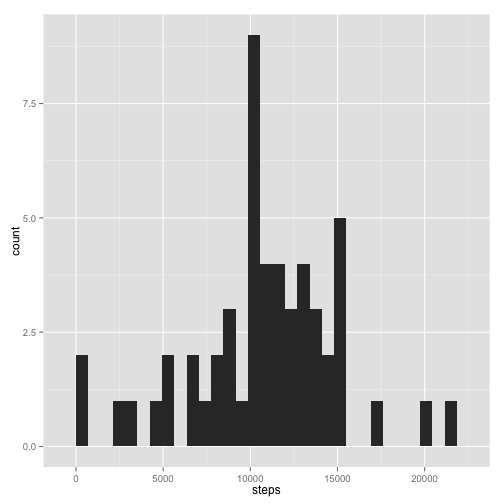

# Reproducible Research: Peer Assessment 1

##Aims
Use file "activity.csv" in this folder and answer questions of assignment 1

##Requirements
- the following packages need to be downloaded beforehand:
  1. plyr
  2. ggplot2

## Loading and preprocessing the data
After changing the working directory where activity.csv is located, the file was loaded into a variable called data as follow, and the first lines were called to check how the file looks like :

```r
library(plyr)
data<-read.csv("activity.csv")
head(data)
```

```
##   steps       date interval
## 1    NA 2012-10-01        0
## 2    NA 2012-10-01        5
## 3    NA 2012-10-01       10
## 4    NA 2012-10-01       15
## 5    NA 2012-10-01       20
## 6    NA 2012-10-01       25
```

```r
#for mean total number of steps per day
dataday<-ddply(data,.(date),numcolwise(sum))
#for 5 min interval average
data2<-ddply(data,.(interval), summarize, mean=mean(steps, na.rm=TRUE))
```

Other data processing is found at respective sections.

## What is mean total number of steps taken per day?

Missing values in the dataset were ignored.

- Histogram of the total number of steps taken each day
Steps of the same day were first added up:

```r
library(ggplot2)
h<-ggplot(dataday, aes(x=steps))
h + geom_histogram()
```

```
## stat_bin: binwidth defaulted to range/30. Use 'binwidth = x' to adjust this.
```

 
 
 - Calculate and report the mean and median total number of steps taken per day


```r
mean<-round(mean(dataday$steps, na.rm=TRUE),2)
median<-round(median(dataday$steps,na.rm=TRUE),2)
cat("Mean is",mean,sep=" ")
```

```
## Mean is 10766
```

```r
cat("Median is",median,sep=" ")
```

```
## Median is 10765
```

## What is the average daily activity pattern?

- Time series plot of the 5-minute interval and the average number of steps taken, averaged across all days.

First we need to calculate the mean of steps for all days of each interval:

```r
head(data2)
```

```
##   interval    mean
## 1        0 1.71698
## 2        5 0.33962
## 3       10 0.13208
## 4       15 0.15094
## 5       20 0.07547
## 6       25 2.09434
```
Then the time series plot is as follow:

```r
plot(data2$mean~data2$interval,type="l",xlab="Interval (every 5 minute)",ylab="Mean of steps, averaged for all days")
```

 

- Next, as I understood, we are looking for the interval value that has the maximum number of steps across the whole dataset. I ordered the dataframe by decreasing number of steps, with na values at the end, and display the first line of column interval:


```r
data[order(data$steps,na.last=TRUE,decreasing=TRUE),]->ordered
cat("the interval with maximum number of steps is",ordered[1,3], sep=" ")
```

```
## the interval with maximum number of steps is 615
```

## Imputing missing values

- Number of rows with NA values

```r
naval<-sum(is.na(data$steps))
row<-nrow(data)
percentna<-naval*100/row
cat("There is",percentna, "of missing data", sep=" ")
```

```
## There is 13.11 of missing data
```
- Filling missing values in the dataset. My strategy is to fill each missing value with the mean of all steps when missing data excluded

```r
mean<-mean(data$steps, na.rm=TRUE)
mean
```

```
## [1] 37.38
```

```r
data->newdata
newdata$steps[is.na(newdata$steps)]=mean
```
- New dataset: new dataset was previously transferred in variable new

```r
head(newdata)
```

```
##   steps       date interval
## 1 37.38 2012-10-01        0
## 2 37.38 2012-10-01        5
## 3 37.38 2012-10-01       10
## 4 37.38 2012-10-01       15
## 5 37.38 2012-10-01       20
## 6 37.38 2012-10-01       25
```

-Histogram of question 1 for the new dataset compared with first histogram


```r
newday<-ddply(newdata,.(date),numcolwise(sum))
par(mfrow=c(2,1))
hist(dataday$steps, 
     breaks=25, 
     col="black",
     xlab="total steps per day",
     ylab="count",
     main="Dataset with missing data excluded")
hist(newday$steps, 
     breaks=25, 
     col="black",
     xlab="total steps per day",
     ylab="count",
     main="Dataset with missing data replaced by mean of steps")
```

 

Means and median for both types of data


```r
#For missing data excluded
cat("When missing data is excluded, we have mean as", mean(dataday$steps, na.rm=TRUE), "and median as", median(dataday$steps,na.rm=TRUE), sep=" ")
```

```
## When missing data is excluded, we have mean as 10766 and median as 10765
```

```r
#When missing data filled in with mean of all steps
cat("When missing data are replaced by the total mean of steps (", mean(data$steps,na.rm=TRUE),")",", we have mean as", mean(newday$steps), "and median as", median(newday$steps), sep=" ")
```

```
## When missing data are replaced by the total mean of steps ( 37.38 ) , we have mean as 10766 and median as 10766
```

With my strategy, incorporating missing data and replacing them by the total mean of all steps did not change the shape of the distribution but seemed to increase the number of counts around the mean of the distribution (see histograms). However, it did not change the mean of steps per day and just increased the median, which is now equals to the mean.

## Are there differences in activity patterns between weekdays and weekends?

We need first to transform the date column as a data format

```r
newdata$date<-as.Date(newdata$date,"%Y-%m-%d")
```

Then we identify from the date column which day of the week correpond to each date row.

```r
newdata$weekdays<-weekdays(newdata$date)
head(newdata)
```

```
##   steps       date interval weekdays
## 1 37.38 2012-10-01        0   Monday
## 2 37.38 2012-10-01        5   Monday
## 3 37.38 2012-10-01       10   Monday
## 4 37.38 2012-10-01       15   Monday
## 5 37.38 2012-10-01       20   Monday
## 6 37.38 2012-10-01       25   Monday
```

Then we can separate two datasets, one including weekdays and the other including weekends

```r
weekdays<-subset(newdata,newdata$weekdays=="Monday"|newdata$weekdays=="Tuesday"|newdata$weekdays=="Wednesday"|newdata$weekdays=="Thursday"|newdata$weekdays=="Friday")
weekends<-subset(newdata,newdata$weekdays=="Saturday"|newdata$weekdays=="Sunday")
```

Then we can add for each dataset an additional column indicating weekday or weekend, end merge again the data


```r
weekdays$week<-"weekday"
weekends$week<-"weekend"
newdataweek<-rbind(weekdays,weekends)
head(newdataweek)
```

```
##   steps       date interval weekdays    week
## 1 37.38 2012-10-01        0   Monday weekday
## 2 37.38 2012-10-01        5   Monday weekday
## 3 37.38 2012-10-01       10   Monday weekday
## 4 37.38 2012-10-01       15   Monday weekday
## 5 37.38 2012-10-01       20   Monday weekday
## 6 37.38 2012-10-01       25   Monday weekday
```

Now we want to make a new dataset that averages steps at each interval for all weekdays or all weekends
Actually, I am going to use the 2 subsets I previously made (stored in variables weekdays and weekends)

```r
weekdays<-ddply(weekdays,.(interval),summarize,mean=mean(steps))
head(weekdays)
```

```
##   interval  mean
## 1        0 7.007
## 2        5 5.384
## 3       10 5.140
## 4       15 5.162
## 5       20 5.073
## 6       25 6.295
```

```r
weekends<-ddply(weekends,.(interval),summarize,mean=mean(steps))
head(weekends)
```

```
##   interval  mean
## 1        0 4.673
## 2        5 4.673
## 3       10 4.673
## 4       15 4.673
## 5       20 4.673
## 6       25 7.923
```
Now, we want to make a figure with the two plots. 

```r
par(mfrow=c(2,1))
with(weekdays, plot(interval,mean,type="l", main="Weekdays",ylab="number of steps"))
with(weekends,plot(interval, mean,type="l",main="Weekend",ylab="number of steps"))
```

 
